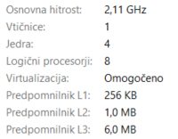
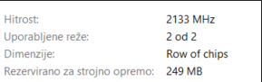

# Paralelna obdelava videa z uporabo MPI in OpenCV:    Pretvorba video sličic v sivinsko obliko in detekcija robov s Sobelovim operatorjem

## 1.	Analizo zmogljivosti: Meritve časa na 1, 2, 4, 8... jedrih (povprečje treh zagonov).

Program zaženemo 3x za vsako število procesov:
-	mpiexec -n 1 MpiVideoProc.exe mp4_example.mp4
-	mpiexec -n 2 MpiVideoProc.exe mp4_example.mp4
-	mpiexec -n 4 MpiVideoProc.exe mp4_example.mp4
-	mpiexec -n 8 MpiVideoProc.exe mp4_example.mp4

Procesor:
 

Pomnilnik:
 

Meritev:
 

Graf meritve:
 

##  2.	Izračun metrik: Določitev pospeška in Karp-Flattove metrike e.
### a.	Pospešek

Pospešek pove, kolikokrat hitrejši je program glede na 1 proces: S(p) = T(1) / T(p). 
Idealno:
-	S(2) = 2
-	S(4) = 4
-	S(8) = 8

Izmerjeno:
-	S(2) = T(1) / T(2) = 20,54913 / 13,0174 = 1,5786
-	S(4) = T(1) / T(4) = 20,54913 / 10,084103 = 2,037
-	S(8) = T(1) / T(8) = 20,54913 / 8,851186 = 2,3216

### b.	Karp-Flattova metrika e

Formula: e = (1 / S(p) - 1 / p) / (1 - 1 / p)
 
Kjer je:
-	p = število procesov
-	S(p) = pospešek pri p procesih
-	e = ocena serijskega deleža / paralelne neučinkovitosti

Interpretacija:
 
-	blizu 0 = dobro paralelno skaliranje
-	večji e = več ozkih grl
-	e raste z več procesi = komunikacija ali režijski stroški naraščajo
  
Izmerjeno:
 
-	e(2) = (1 / 1,5786 - 1 / 2) / (1 - 1 / 2) = 0,2669
-	e(4) = (1 / 2,037 - 1 / 4) / (1 - 1 / 4) = 0,3212
-	e(8) = (1 / 2,3216 - 1 / 8) / (1 - 1 / 8) = 0,3494

### c.	Graf meritev

 

 

## 3.	Interpretacijo rezultatov: Razlago odmikov od idealnega pospeška in identifikacijo ozkih grl (npr. preveč MPI komunikacije ali neenakomerna porazdelitev dela).
Rezultati kažejo, da paralelizacija z uporabo MPI zmanjša čas obdelave videa, vendar pohitritev ni linearna glede na število procesov. Pri enem procesu je povprečni čas izvajanja znašal približno 20,55 s, pri osmih procesih pa se je zmanjšal na približno 8,85 s. To pomeni približno 2,32 kratni pospešek glede na zaporedno izvedbo.

Idealni pospešek bi pomenil, da bi se čas izvajanja zmanjševal sorazmerno s številom procesov. Pri štirih procesih bi tako pričakovali približno štirikratno pohitritev, pri osmih procesih pa osemkratno. Iz rezultatov je razvidno, da dejanski pospešek bistveno odstopa od idealnega. Pri osmih procesih je dosežen pospešek le približno 2,32 namesto idealnih 8.
Glavni razlog za odstopanje od idealnega pospeška so komunikacijski in režijski stroški MPI. Proces rank 0 mora najprej prebrati celoten video, pripraviti vse frame-e, jih pretvoriti v zaporedje bajtov ter jih razdeliti ostalim procesom. Po končani obdelavi mora rank 0 ponovno zbrati vse rezultate ter zapisati izhodni video. Ti deli programa ostanejo serijski in omejujejo skupno pohitritev. Dodaten vpliv imajo tudi stroški kopiranja podatkov. Vsak frame se večkrat kopira med OpenCV strukturami in MPI medpomnilniki.
Pri večjem številu procesov se poveča količina komunikacije in kopiranje podatkov med procesi, zato dodatni procesi ne prinesejo sorazmernega zmanjšanja časa izvajanja. To potrjuje tudi Karp-Flattova metrika, saj vrednost e z večanjem števila procesov narašča:
-	2 procesa: e = 0,2669
-	4 procesi: e = 0,3212
-	8 procesov: e = 0,3494

Kljub temu rezultati potrjujejo, da je MPI primeren za paralelno obdelavo video datotek, saj se čas izvajanja z večanjem števila procesov vseeno zmanjša. Največja korist paralelizacije bi bila pričakovana pri še večjih videih ali računsko zahtevnejših algoritmih obdelave slike, kjer bi razmerje med časom računanja in komunikacijskimi stroški postalo ugodnejše.

 
